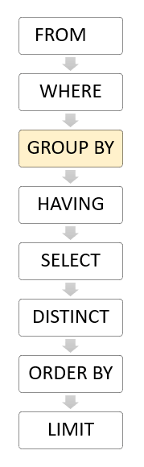
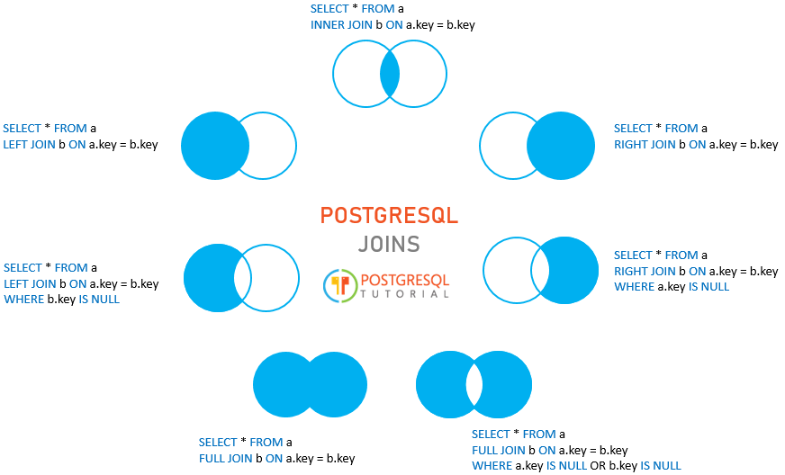

# PostgreSQL basics

## Basic commands

### SELECT

One of the most common tasks, when you work with the database, is to retrieve data from tables
using the SELECT statement.

The SELECT statement is one of the most complex statements in PostgreSQL.
It has many clauses that you can use to form a flexible query.

Due to its complexity, we will break it down into many shorter and easy-to-understand tutorials so
that you can learn about each clause faster.

The SELECT statement has the following clauses:

- Select distinct rows using DISTINCT operator.
- Sort rows using ORDER BY clause.
- Filter rows using WHERE clause.
- Select a subset of rows from a table using LIMIT or FETCH clause.
- Group rows into groups using GROUP BY clause.
- Filter groups using HAVING clause.
- Join with other tables using joins such as INNER JOIN, LEFT JOIN, FULL OUTER JOIN, CROSS JOIN clauses.
- Perform set operations using UNION, INTERSECT, and EXCEPT.

### Syntax

```PostgreSQL
SELECT
   select_list
FROM
   table_name;
```

In this syntax:

First, specify a select list that can be a column or a list of columns in a table from
which you want to retrieve data. If you specify a list of columns,
you need to place a comma (,) between two columns to separate them.
If you want to select data from all the columns of the table, you can use an asterisk (\*) shorthand instead of specifying all the column names. The select list may also contain expressions or literal values.

Second, provide the name of the table from which you want to query data after the FROM keyword.
The FROM clause is optional. If you are not querying data from any table, you can omit the FROM
clause in the SELECT statement.

PostgreSQL evaluates the FROM clause before the SELECT clause in the SELECT statement:






## Summary of filtering and grouping:

### Section 1. Querying Data

- Select – show you how to query data from a single table.

- Column aliases – learn how to assign temporary names to columns or expressions in a query.

- Order By – guide you on how to sort the result returned from a query.

- Select Distinct – provide you with a clause that removes duplicate rows in the result set.

### Section 2. Filtering Data

- Where – filter rows based on a specified condition.

- Limit – get a subset of rows generated by a query.

- Fetch– limit the number of rows returned by a query.

- In – select data that matches any value in a list of values.

- Between – select data that is a range of values.

- Like – filter data based on pattern matching.

- Is Null – check if a value is null or not.

### Section 3. Grouping Data

- Group By – divide rows into groups and applies an aggregate function on each.

- Having – apply conditions to groups.

### SQL conditional Operators

| Operator | Description                                         |
|----------|-----------------------------------------------------|
| =        | Equal                                               |
| >        | Greater than                                        |
| <        | Less than                                           |
| >=       | Greater than or equal                               |
| <=       | Less than or equal                                  |
| <> or != | Not equal                                           |
| AND      | Logical operator AND                                |
| OR       | Logical operator OR                                 |
| IN       | Return true if a value matches any value in a list  |
| BETWEEN  | Return true if a value is between a range of values |
| LIKE     | Return true if a value matches a pattern            |
| IS NULL  | Return true if a value is NULL                      |
| NOT      | Negate the result of other operators                |
